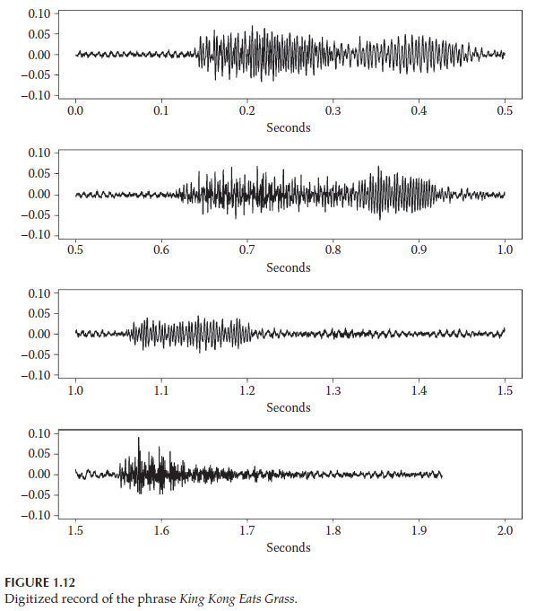

**Data Challenge 1.2**

Read in the `kingkong` dataset and recreate Figure 1.12 from Woodward et al (2017) textbook.
When plotting the time, be careful to note the frequency at which the data were collected (i.e., 8k Hz). 

