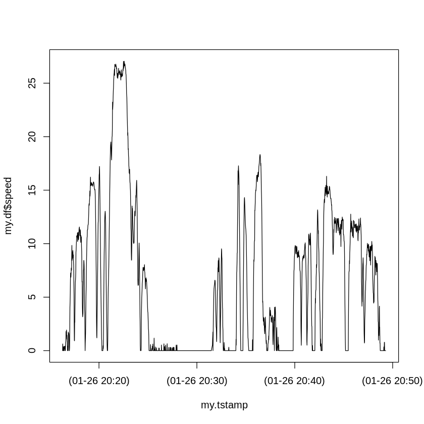

# Example Notes
Written by T.W. Davis 

Last edited: 2021-01-27

### January 25, 2020
A **random** variable, Y, is a function defined on a sample space, &Omega;, whose range is the **real numbers**.
An **observation** of a random variable, y = Y(&omega;) for a given &omega; &isin; &Omega;, is a real number.

### January 27, 2020
How to install a new package in R.
Notice that booleans are in all caps (e.g., `TRUE` and `FALSE`).

```R
install.packages("chron", dependencies = TRUE)
```

Read a dataset using R.

```R
my.data <- read.table("~/data.txt")
```

Do a simple plot using a solid line:

```R
plot(my.data$x, my.data$y, type="l", lty=1)
```

It might look something like this:




***

### References

For HTML codes: http://www.amp-what.com/
